## Histogram
```{r}
library(ggplot2)
library(gridExtra)
dt = read.csv('pseudo_facebook.tsv', sep = '\t')
qplot(x = dob_day, data = dt, color = I('black'), fill = I('#099DD9')) + scale_x_discrete(1:31)
```
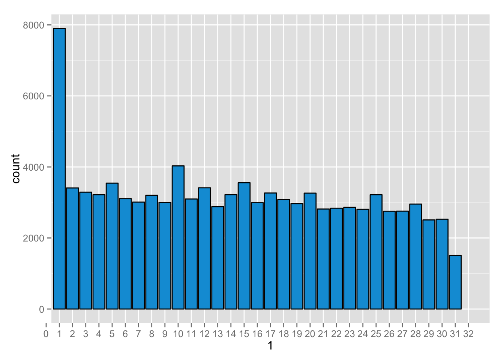 

## Faceting
```{r,}
qplot(x = dob_day, data = dt, color = I('black'), fill = I('#099DD9')) + scale_x_discrete(1:31) +
        facet_wrap(~dob_month, ncol = 3)
```
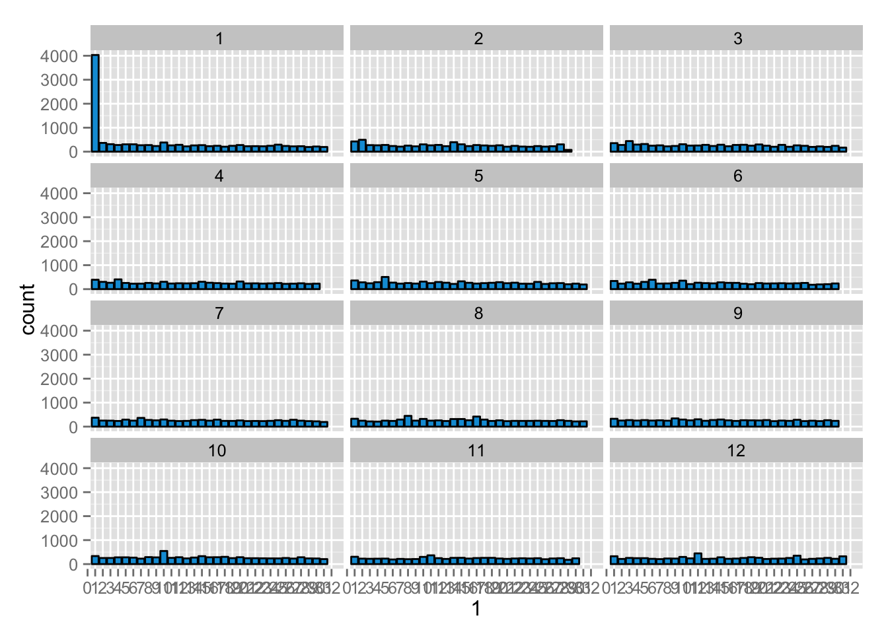 

## Friend Count
```{r,}
qplot(x = friend_count , data = dt, color = I('black'), fill = I('#099DD9'))
```
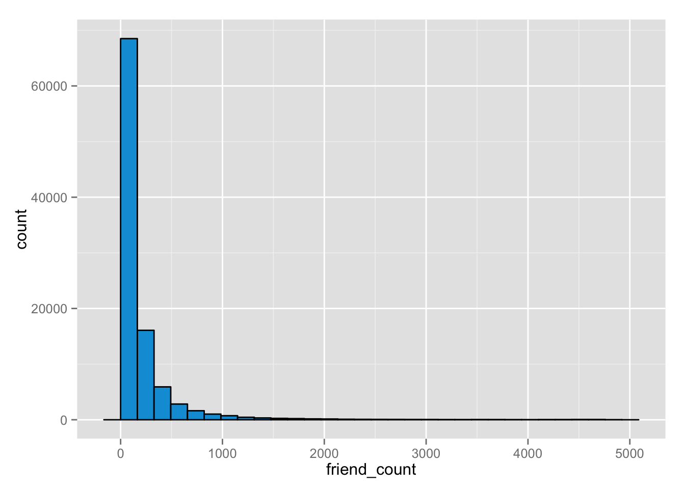 

## Limiting the area
```{r,}
qplot(x = friend_count , data = dt, color = I('black'), fill = I('#099DD9')) +
        scale_x_continuous(limits = c(0, 1000))
```
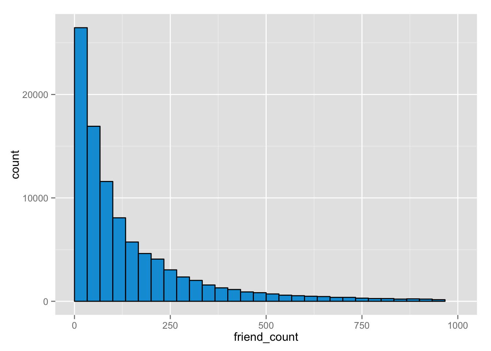 

## Adjusting the bin width
```{r,}
qplot(x = friend_count , data = subset(dt, !is.na(gender)), color = I('black'), fill = I('#099DD9'), binwidth = 25) +
        scale_x_continuous(limits = c(0, 1000), breaks = seq(0,1000,50)) +
        facet_wrap(~gender)
```
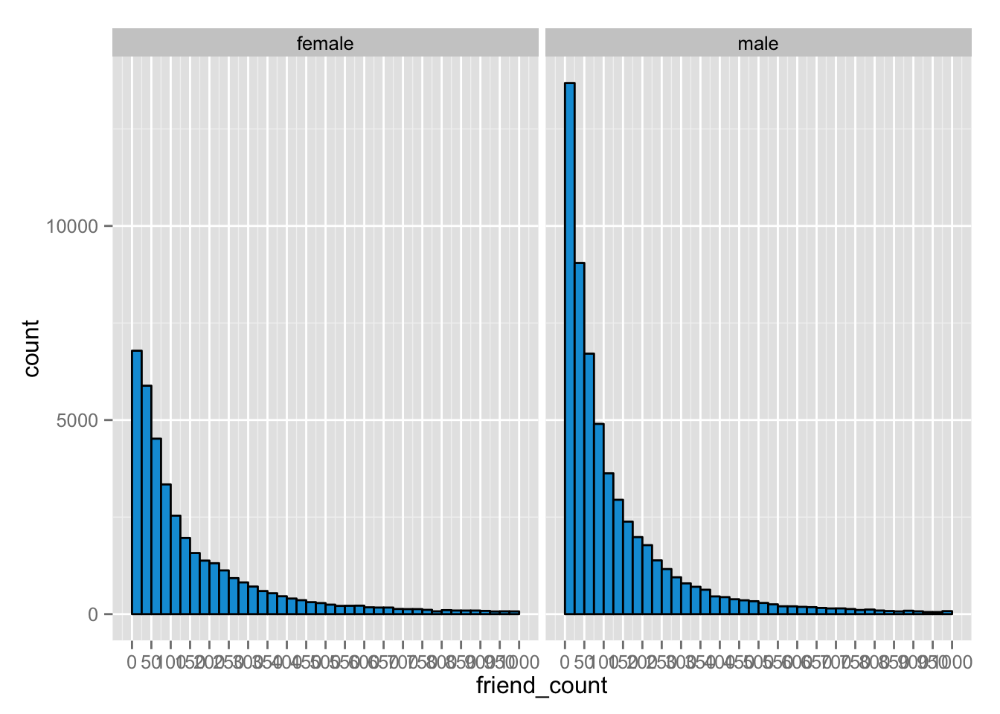 

## Statistics 'y' gender
```{r,}
by(dt$friend_count, dt$gender, summary)
```

## Tenure
```{r,}
qplot(x = tenure/365, data = dt, binwidth = .25, color = I('black'), fill = I('#099DD9')) +
        scale_x_continuous(breaks = seq(1,7,1), limits = c(0,7)) +
        labs(x = 'Number of years using Facebook', y = 'Number of users in sample')
```
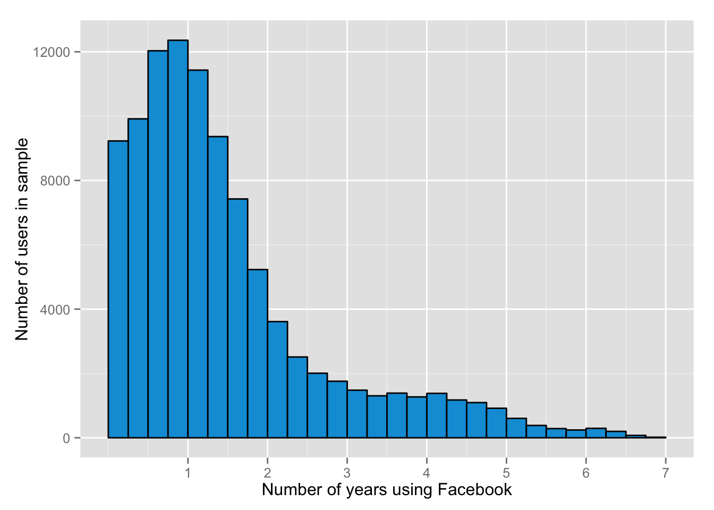 

## Age
```{r,}
qplot(x = age, data = dt, binwidth = 1, color = I('black'), fill = I('#099DD9')) +
        scale_x_continuous(breaks = seq(0,113,5)) +
        labs(x = 'Age of Facebook users', y = 'Number of users in sample')
```
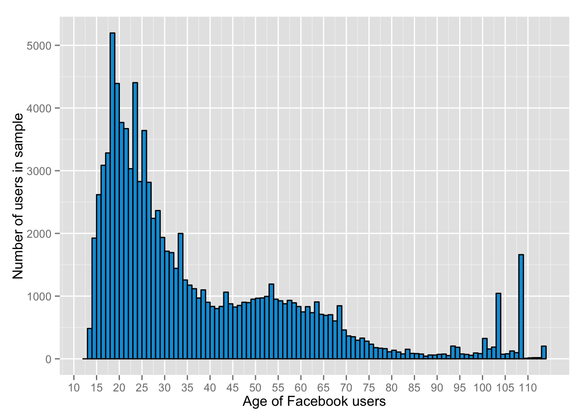 

## Transform & visualize data
```{r,}
f1 = ggplot(aes(x = friend_count), data = dt) + 
        geom_histogram(color = 'black', fill = '#099DD9')
f2 = f1 + scale_x_log10()
f3 = f1 + scale_x_sqrt()

grid.arrange(f1,f2,f3, ncol = 1)
```
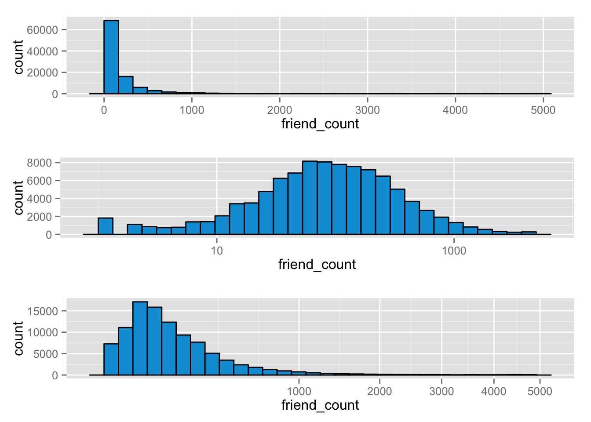 

## Frequency polygon
```{r,}
qplot(x = friend_count, y = ..count../sum(..count..),
        data = subset(dt, !is.na(gender), color = I('black'), 
        fill = I('#099DD9')), binwidth = 10, 
        geom = 'freqpoly', color = gender) + 
        labs(x = 'Friend count', y = 'Propertion of users friend count')
        scale_x_continuous(limits = c(0, 1000), breaks = seq(0,1000,50))
```
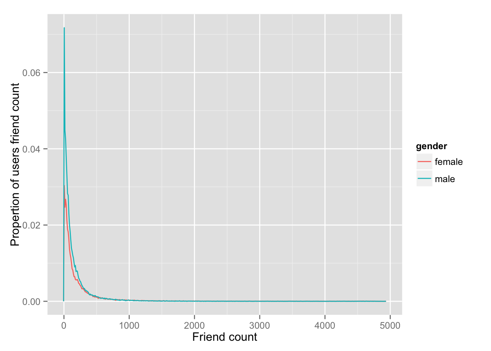 

## Frequency polygon 2
```{r,}
qplot(x = www_likes, data = subset(dt, !is.na(gender)), 
        geom = 'freqpoly', color = gender) + 
        labs(x = 'Friend count', y = 'Propertion of users friend count') +
        scale_x_log10()
```
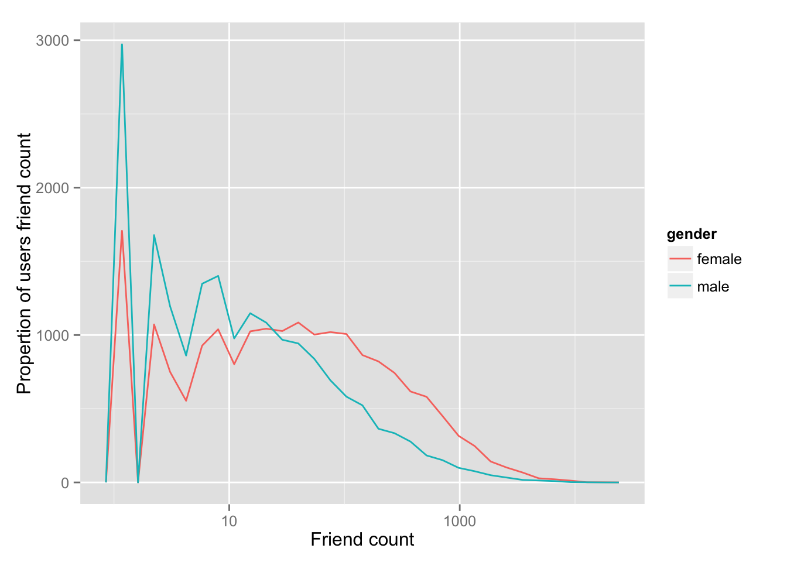 

## Box plot
```{r,}
qplot(x = gender, y = friend_count, data = subset(dt, !is.na(gender)), 
       color = I('black'), fill = I('#099DD9'),
       geom = 'boxplot') +
       coord_cartesian(ylim = c(0,1000))
```
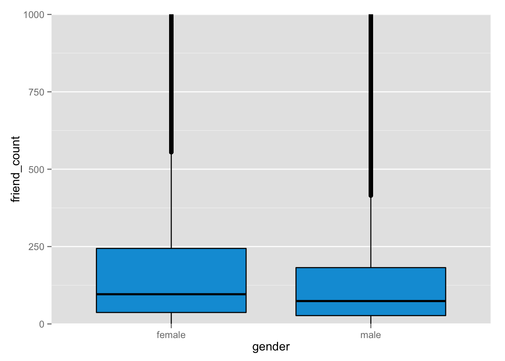 

